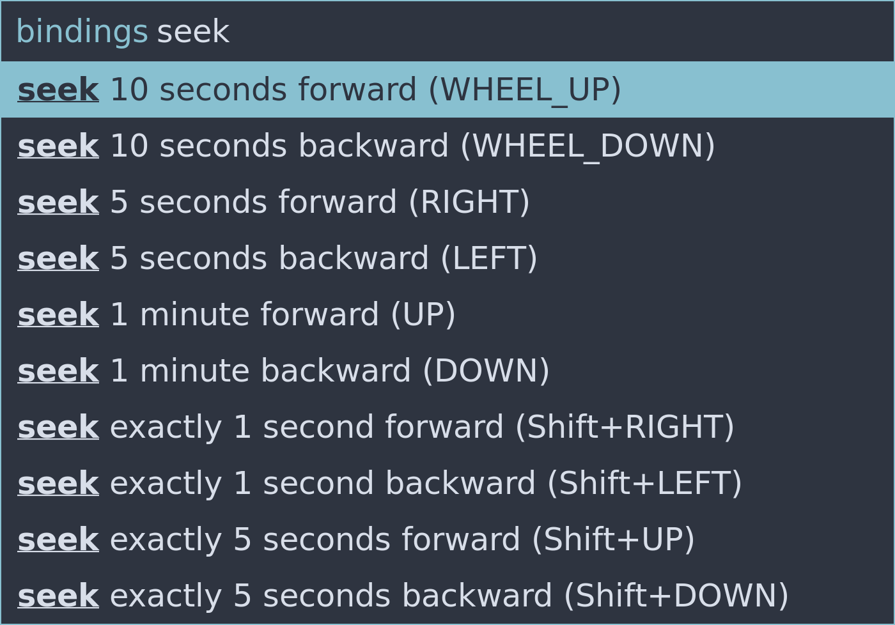

# mpv-rofi-menu

mpv-rofi-menu allows to search for mpv player input bindings using Rofi,
which is a popular keystroke Launcher on Linux.

## Requirements

- Linux and X11 (for Wayland there is wofi)
- mpv player
- Rofi launcher

## input.conf

`F1 script-message-to mpv_rofi_menu show-rofi-menu bindings`

## Location of Python file

`~/.config/rofi/mpv-rofi-menu.py`

## Screenshot

## Related projects:

- https://github.com/Seme4eg/mpv-scripts/tree/master#m-x
- https://github.com/CogentRedTester/mpv-search-page
- https://github.com/stax76/mpv-scripts/blob/main/osm.lua
- https://github.com/mpvnet-player/mpv.net#command-palette
  - https://github.com/mpvnet-player/mpv.net/blob/master/docs/Manual.md#command-palette
- https://albertlauncher.github.io
- https://gist.github.com/avih/bee746200b5712220b8bd2f230e535de
- https://github.com/nezumisama/mpvmenu
- https://gitlab.com/carmanaught/mpvcontextmenu
